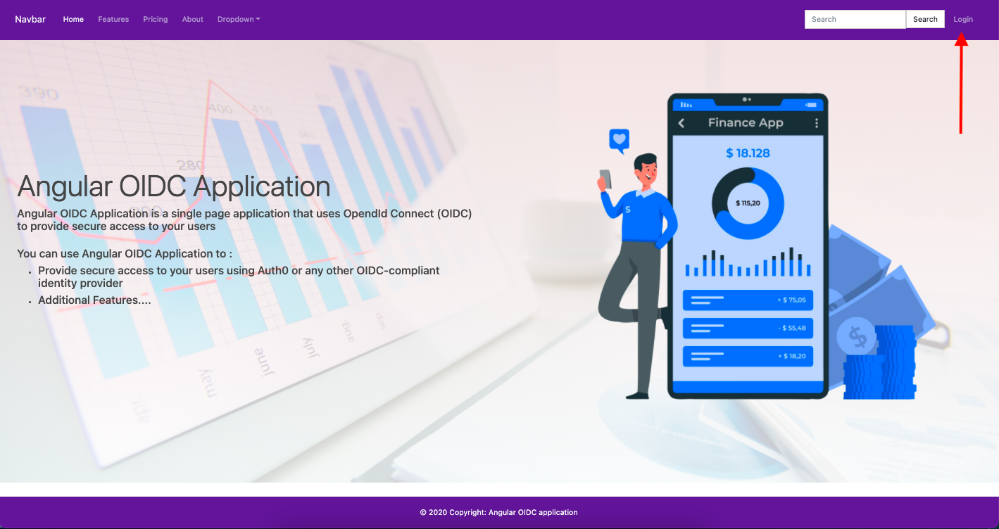
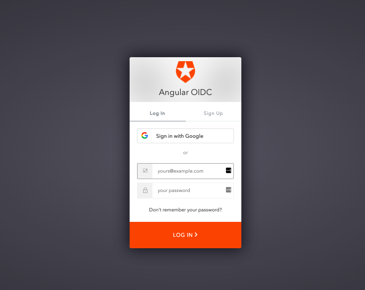
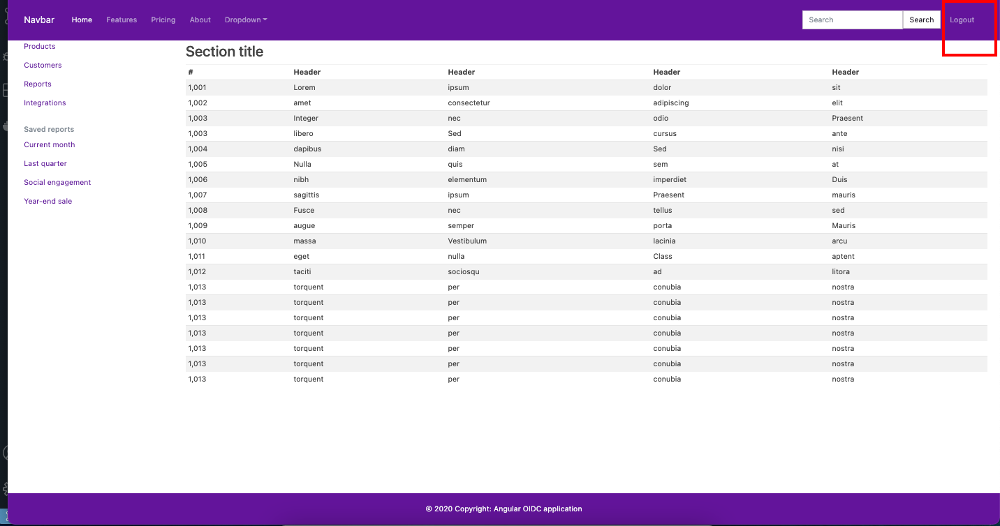

<!-- ⚠️ This README has been generated from the file(s) "blueprint.md" ⚠️--><p align="center">
  
</p>

<h1 align="center">angular-oidc-template</h1>

<p align="center">
		<a href="https://github.com/Web-Tech-Projects/Angular-template/actions/workflows/build.yml"></a>
<a href="https://dashboard.cypress.io/projects/tbbs2j/runs"></a>
<a href="https://codecov.io/gh/FullStack-Templates/Angular-template"></a>
<a href="https://www.codacy.com/gh/FullStack-Templates/Angular-template/dashboard?utm_source=github.com&amp;utm_medium=referral&amp;utm_content=FullStack-Templates/Angular-template&amp;utm_campaign=Badge_Grade"></a>
<a href="https://david-dm.org/FullStack-Templates/Angular-template"></a>
<a href="https://github.com/Web-Tech-Projects/Angular-template/actions/workflows/deploy.yml"></a>
<a href="https://app.netlify.com/sites/my-angular-template/deploys"></a>
	</p>


[](#tech-stack--service-aws-lambdahttpsimgshieldsiobadge-angular-greenstylesociallogoangular--service-aws-lambdahttpsimgshieldsiobadge-typescript-greenstylesociallogotypescript-service-aws-lambdahttpsimgshieldsiobadge-aws-greenstylesociallogoamazonaws--service-aws-lambdahttpsimgshieldsiobadge-githubactions-greenstylesociallogogithubactions--service-aws-lambdahttpsimgshieldsiobadge-auth0-greenstylesociallogoauth0-service-aws-lambdahttpsimgshieldsiobadge-openidconnect-greenstylesociallogoopenid-)

## ➤ Tech Stack           

This project can be used as an  Angular template for building a responsive Single Page Application with:
- An elegant landing page
- A secure home page
- A secure login using Auth0, a leading OpenID Connect compliant Identity Provider

The tech stack used are:
- Angular as the SPA framework
- angular-oauth2-oidc as OpenID certified javascript library
- Auth0 as the OpenID compliant Identity Provider
- AWS S3 for hosting the application
- GitHub Actions as the CI/CD tool


[](#cicd-and-metrics)

## ➤ CI/CD and metrics:
- [GitHub Actions](https://github.com/FullStack-Templates/Angular-template/actions) for continuous integration and delivery to S3
- [Cypress](https://dashboard.cypress.io/projects/tbbs2j/analytics/runs-over-time) for e2e tests
- [Coveralls](https://app.codecov.io/gh/FullStack-Templates/Angular-template) for Code Coverage reports
- [CodeCov](https://app.codacy.com/gh/FullStack-Templates/Angular-template/dashboard?utm_source=github.com&utm_medium=referral&utm_content=FullStack-Templates/Angular-template&utm_campaign=Badge_Grade) for Code quality reports


[](#project-documentation)

## ➤ Project Documentation:
- Detailed documenation is available [here](https://www.todaystechnology.org/post/part-1-a-responsive-angular-app-with-openid-connect)
- Live preview available at: 
   - [GitHub Pages](https://fullstack-templates.github.io/Angular-template)
   - [S3 static website](http://my-angular-template.s3-website-us-east-1.amazonaws.com)
   - [Netify](https://my-angular-template.netlify.app)

Landing Page           |  Auth0 Login |  Home Page
:-------------------------:|:-------------------------:|:-------------------------:
  |   | 

[](#project-dependencies)

## ➤ Project Dependencies

To build and run this project, you'll need the following tools.

* Node.js - [Install Node.js 12x+](https://nodejs.org/en/), including the NPM package management tool.
* Angular CLI - [Install the Angular CLI](https://angular.io/cli)
* AWS CLI (optional) - [Install AWS CLI](https://docs.aws.amazon.com/cli/latest/userguide/install-cliv2.html)


[](#build-the-application)

## ➤ Build the Application
To build your application for the first time, run the following in your shell:

```console
foo@bar:~$: npm install
foo@bar:~$: npm run build
```


[](#run-the-application)

## ➤ Run the application
To run this application for the first time, run the following in your shell:

```console
foo@bar:~$: npm run start
```

Open up the browser to http://127.0.0.1:4200 to view the application


[](#deploy-the-application)

## ➤ Deploy the application

Deployment recommendations for this application are available [here](https://github.com/FullStack-Templates/Angular-template/wiki)


[](#project-documentation)

## ➤ Project Documentation

To customize the project's documentation, please see [Project Documentation And Metrics](https://github.com/FullStack-Templates/Angular-template/wiki/Project-Documentation-And-Metrics)

